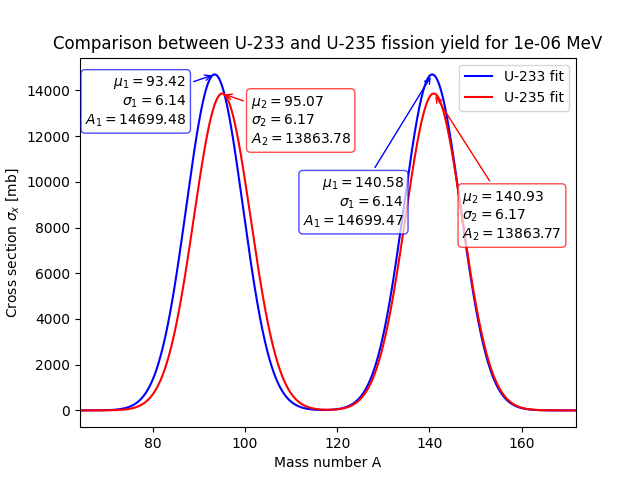
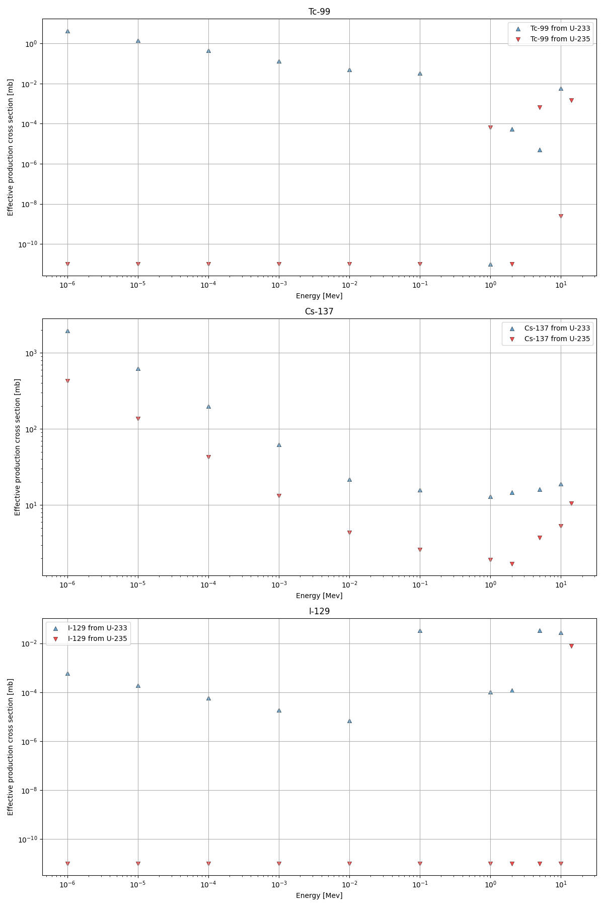

# Analysis of Neutron-Induced Fission Yield Distributions

This repository contains a Python-based analysis of fission fragment mass distributions for **U-233** and **U-235**. The project utilizes data generated by the **TALYS** nuclear reaction code to model fission yields and track key fission products.

## Project Overview
The study focuses on the asymmetric nature of nuclear fission at low and intermediate energies. By applying a double-Gaussian fitting technique, the project extracts key parameters of the fission process, such as peak positions, widths, and amplitudes for both light and heavy fragment groups.

### Key Objectives:
- **Double-Gaussian Approximation**: Modeling the mass distribution $Y(A)$ as a sum of two Gaussian peaks.
- **Isotopic Comparison**: Analyzing the differences between U-233 and U-235 yield profiles at thermal energy ($10^{-6}$ MeV).
- **Radiotoxic Isotope Tracking**: Evaluating the production cross-sections for isotopes significant for nuclear waste management: $^{99}\text{Tc}$, $^{129}\text{I}$ (long-lived) and $^{137}\text{Cs}$ (medium-lived).
- **Custom Data Support**: Users can generate their own fission reactions using **TALYS** and use this script to analyze the output.

## Methodology
The fission yield is approximated using the following double-Gaussian formula:

$$Y(A) = A_1 \exp\left(-\frac{(A - \mu_1)^2}{2\sigma_1^2}\right) + A_2 \exp\left(-\frac{(A - \mu_2)^2}{2\sigma_2^2}\right)$$

## Results & Visualization
The analysis provides insight into the shell effects in fission. While the heavy fragment peak remains relatively stable around $A \approx 140$, the light fragment peak shifts depending on the mass of the fissioning nucleus.

### Thermal Yield Comparison
The plot below compares the fitted mass distributions for U-233 and U-235 at thermal energy. Note the shift in the light fragment peak between the two isotopes.




### Fission Product Production vs. Energy
The following graphs show the effective production cross-sections for $^{99}\text{Tc}$, $^{129}\text{I}$, and $^{137}\text{Cs}$. These isotopes are critical for long-term waste management due to their radioactivity and environmental mobility.




## Repository Structure
- `U233/` & `U235/`: Directories containing TALYS output files (`yieldA*.fis` and `rp*.tot`).
- `scripts/fission_analysis.py`: Main Python script for data processing and fitting.
- `figures/`: Generated plots (saved automatically by the script).

## Requirements
```bash
pip install numpy matplotlib scipy
```
How to Run

    Clone the repository.

    Ensure the TALYS output files are in their respective directories.

    Execute the script: python scripts/fission_analysis.py

Generating Your Own Data

You can generate your own reactions using the TALYS code. To get compatible output, ensure you enable fission yield calculations in your TALYS input file (e.g., using fission y). Place the resulting files in the isotope folders to perform your own analysis.

## References & Acknowledgments
- **TALYS Software**: A.J. Koning, S. Hilaire, and S. Goriely. [Official TALYS website](https://talys.eu/).
- **Main Publication**: 
  Koning, A.J., Hilaire, S. & Goriely, S. *TALYS: modeling of nuclear reactions*. Eur. Phys. J. A 59, 131 (2023). [https://doi.org/10.1140/epja/s10050-023-01034-4](https://doi.org/10.1140/epja/s10050-023-01034-4)

Author: Jakub Krysinski
Tools: TALYS, Python (NumPy, SciPy, Matplotlib)
License: MIT
